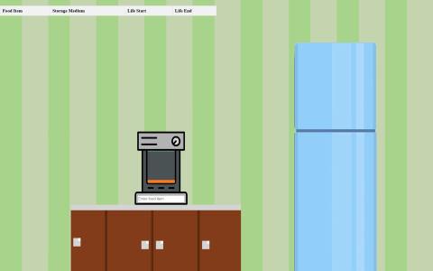

# food-tracker
food-tracker is a web application designed to help track food expirations in a kitchen. 
With the integration of a generative AI Model API from Eden AI, I can roughly 
predict the expiration of common food items. Although the project is in its early 
development stage, a functional version is can be accessed [here](https://food-tracker-0bd8.onrender.com).

Click on the image to watch a demo. 
